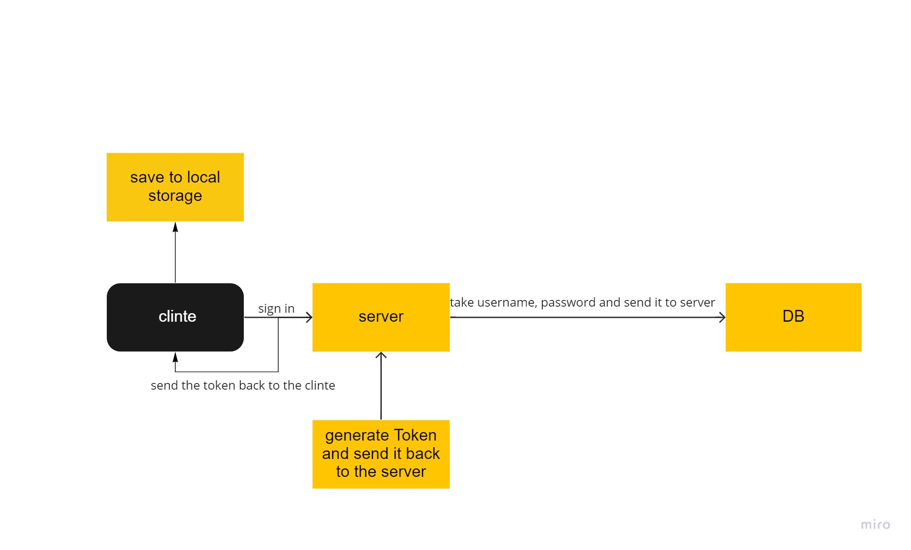

# bearer-auth

## My notes

*I have basic Auth, and bearer Auth here*

**“Auth” routes for handling the login and authentication system:**
+ POST `/signup` to create an account
+ POST `/signin` to login with Basic Auth
+ GET `/user`

**Middleware for handling 404 and 500 conditions**

**Middleware for handling each type of authentication**
+ basic.js
+ bearer.js

**Data Types**
+ `username: Type: String, Required false`
+ `password: Type: String, Required false`

**UML**

[pull req]()
[heroku]()
[actions]()